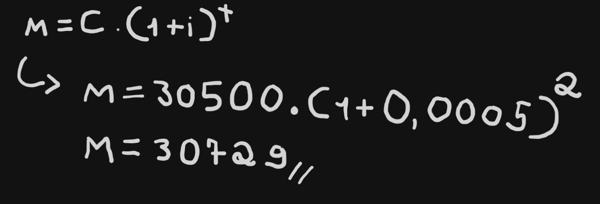

# Woovi Challenge - Crédito em cima do PIX

| Status         | Proposto                                             |
:----------------|:---------------------------------------------------- |
| **PR  #**      | -                                                    |
| **Autor(es)**  | Pedro Viana(sttormx) e Arthur(arthcc)                |
| **Atualizado** | 2024-05-17                                           |

## Objetivo

A feature irá permitir que um usuário realize um pagamento de um valor utilizando PIX como um valor de entrada e CŔEDITO para o restante do valor.

Um **exemplo** de uso é um usuário que deseja realizar o pagamento de uma fatura, mas não tem o saldo total na sua conta. Ele poderá utilizar o crédito que ele tem disponível em cartão para complementar o pagamento.

## Motivação

A motivação dessa feature é **aprender**. Entender mais sobre como gateways operam de forma mais profunda.

## Benefícios do usuário

A feature permite que o usuário tenha ainda mais opções e condições financeiras de pagar. Isso significa mais lucro para o negócio.

## Proposta - Design System

Para descrever o design, vou esboçar todo o pensamento, no formato de um flow, que se inicia a partir do momento que um usuário decide escolher pagar por PIX.

## Design System - Opções de Pagamento

Nessa seção, vamos cobrir tudo referente as opções de pagamento que serão oferecidas (a primeira tela do print do desafio)

### O usuário poderá pagar parcelado?

Devemos levar o seguinte item em consideração: **O lucro que teremos com o juros**.
- O lucro será suficiente para pagar o custo de operação?
- Se sim, ele será um lucro considerável e que valha a pena para a empresa?

Essas questões precedem as opções de pagamento e são essenciais para a montagem e exibição da tela.

### Obtendo as opções de Pagamento

No front-side, iremos fazer a query:
```
type Installment {
  value: Float!
  total: Float!
}

type ValidateInstallment {
  isValid: Boolean!
  Installments: [Installment]
}

type Query {
  validateValue(value: Float!): ValidateInstallment
}
```

Observe que nem todo valor será válido de parcelamento. O back-side será responsável por todas as validações. Installments é a estrutura de dados que armazena as informações relacionada a cada parcela.

### Validações no back-side

#### O Valor enviado é valido de parcelamento?

A verificação depende exclusivamente de regras de negócio. Como isso é um desafio, vamos definir uma regra constante. **Qualquer valor acima de 50R$ será válido para parcelamento**.

#### Calculando as parcelas

Para calcular as parcelas, vamos utilizar juros compostos. No exemplo da foto, está o cálculo do valor total. O back irá aplicar essa fórmula para calcular o montante referente a 12 meses, que será o máximo possível do parcelamento. 

A partir daí, o back irá apenas percorrer um for de tamanho 12 e dividir esse valor e formar o array com os Installments.


